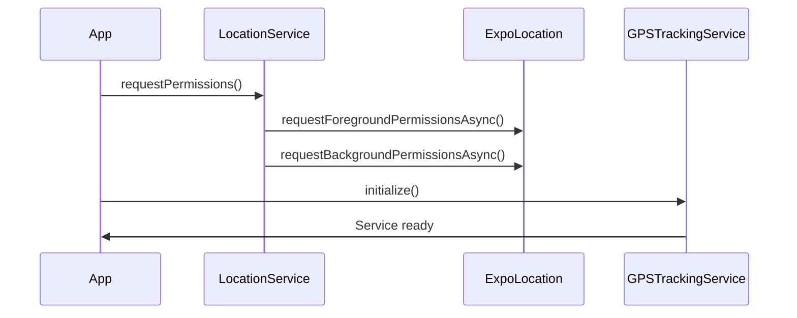
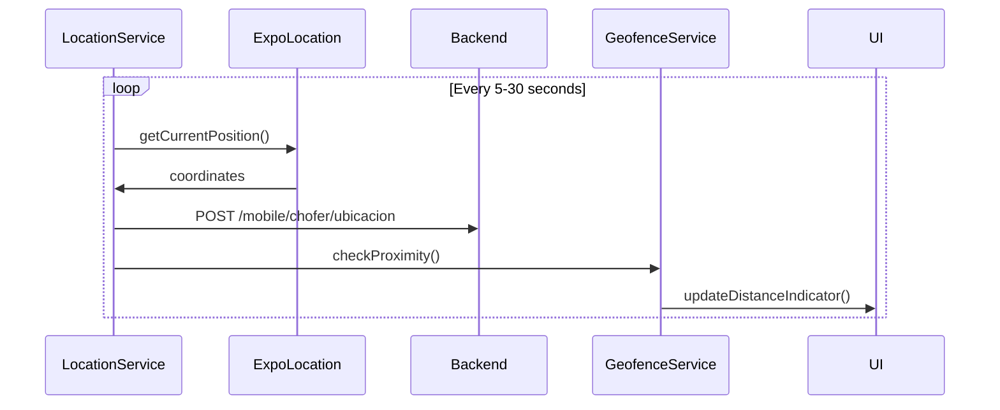
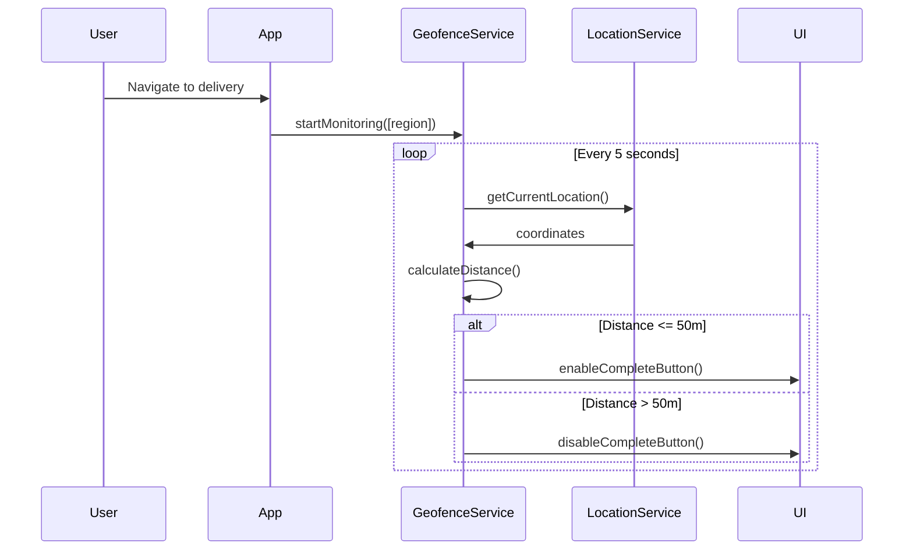

# Reporte: Servicios de Ubicación y Mapas en FultraApps 2.0

## 📍 Resumen Ejecutivo

El proyecto FultraApps 2.0 **NO utiliza HERE Maps** específicamente, sino que implementa un sistema completo de geolocalización y mapas utilizando **React Native Maps** con **Google Maps** como proveedor principal. Este sistema está diseñado para el tracking GPS en tiempo real de choferes y la gestión de entregas con geocercas.

## 📦 Librerías y Dependencias Utilizadas

### Core de Ubicación y Mapas
- **react-native-maps** (v1.20.1): Componente principal de mapas
- **expo-location** (v19.0.7): Servicios de geolocalización nativa
- **expo-task-manager** (v14.0.8): Gestión de tareas en segundo plano

### Configuración del Proveedor
```typescript
// Proveedor configurado: Google Maps
import { PROVIDER_GOOGLE } from 'react-native-maps';
```

## 🗺️ Arquitectura del Sistema de Ubicación

### 1. Estructura de Servicios

```
src/
├── shared/
│   ├── services/
│   │   └── gpsTrackingService.ts     // Servicio principal de GPS
│   └── components/
│       └── LiveTrackingMap.tsx       // Componente de mapa en tiempo real
└── apps/entregas/
    ├── services/
    │   ├── locationService.ts        // Servicio de ubicación
    │   └── geofenceService.ts        // Servicio de geocercas
    ├── components/
    │   └── MapViewComponent.tsx      // Componente de vista de mapa
    └── screens/
        ├── EntregaTrackingScreen.tsx // Pantalla de tracking
        └── MapRutaScreen.tsx         // Pantalla de ruta
```

## 🔧 Funcionalidades Principales

### 1. GPS Tracking Service (`gpsTrackingService.ts`)

#### **Propósito**: Servicio central para tracking GPS en tiempo real

#### **Funciones Principales**:

##### `initialize()` → `Promise<boolean>`
- **Función**: Inicializar el servicio de tracking
- **Implementación**: Solicita permisos de ubicación
- **Flujo**: 
  ```typescript
  const { status } = await Location.requestForegroundPermissionsAsync();
  return status === 'granted';
  ```

##### `startTracking()` → `Promise<void>`
- **Función**: Iniciar tracking en tiempo real
- **Configuración**:
  ```typescript
  {
    accuracy: Location.Accuracy.High,
    timeInterval: 5000, // Cada 5 segundos
    distanceInterval: 10, // O cada 10 metros
  }
  ```

##### `calcularDistancia(punto1, punto2)` → `number`
- **Función**: Calcular distancia usando fórmula de Haversine
- **Implementación**: 
  ```typescript
  const R = 6371000; // Radio de la Tierra en metros
  // Cálculo matemático preciso de distancia geográfica
  ```

##### `simularMovimiento(origen, destino, opciones)`
- **Función**: Simular movimiento para testing
- **Características**:
  - Velocidad configurable (default: 40 km/h)
  - Interpolación lineal entre puntos
  - Callbacks de progreso
  - Envío automático al backend

### 2. Location Service (`locationService.ts`)

#### **Propósito**: Manejo de ubicación con soporte para background tracking

#### **Funciones Principales**:

##### `requestPermissions()` → `Promise<boolean>`
- **Función**: Solicitar permisos de ubicación (foreground y background)
- **Flujo**:
  ```typescript
  const { status: foregroundStatus } = await Location.requestForegroundPermissionsAsync();
  const { status: backgroundStatus } = await Location.requestBackgroundPermissionsAsync();
  ```

##### `startForegroundTracking(choferId)` → `Promise<boolean>`
- **Función**: Tracking activo mientras la app está abierta
- **Configuración**:
  ```typescript
  {
    accuracy: Location.Accuracy.High,
    distanceInterval: 10,
    timeInterval: 30000, // 30 segundos
  }
  ```

##### `startBackgroundTracking(choferId)` → `Promise<boolean>`
- **Función**: Tracking en segundo plano
- **Características**:
  - Notificación persistente
  - TaskManager para procesamiento
  - Cola de ubicaciones offline
  - Sincronización automática

##### `syncQueuedLocations()` → `Promise<void>`
- **Función**: Sincronizar ubicaciones en cola cuando hay conectividad
- **Flujo**:
  ```typescript
  // 1. Leer cola de AsyncStorage
  // 2. Enviar por lotes al backend
  // 3. Limpiar cola tras éxito
  ```

### 3. Geofence Service (`geofenceService.ts`)

#### **Propósito**: Sistema de geocercas para detectar proximidad

#### **Funciones Principales**:

##### `startMonitoring(regions, callback)`
- **Función**: Monitorear múltiples regiones geográficas
- **Configuración**:
  ```typescript
  interface GeofenceRegion {
    identifier: string;
    latitude: number;
    longitude: number;
    radius: number; // metros
  }
  ```

##### `checkGeofences()` (privada)
- **Función**: Verificar cada 5 segundos si el usuario entra/sale de geocercas
- **Algoritmo**:
  ```typescript
  const distance = calculateDistance(currentLocation, region.center);
  const isInside = distance <= region.radius;
  
  if (isInside !== wasInside) {
    callback(region, isInside ? 'ENTER' : 'EXIT');
  }
  ```

## 📱 Componentes de UI

### 1. LiveTrackingMap (`LiveTrackingMap.tsx`)

#### **Propósito**: Mapa interactivo con tracking en tiempo real

#### **Características**:
- **Marcadores dinámicos**: Chofer y punto de entrega
- **Geocerca visual**: Círculo de 50m alrededor del destino
- **Polyline**: Ruta recorrida en tiempo real
- **Controles**: Centrar mapa, play/pause tracking, simulación
- **Validación de proximidad**: Habilitar botón "Completar" solo dentro de geocerca

#### **Elementos del Mapa**:
```typescript
// Marcador del punto de entrega
<Marker pinColor="red" />

// Geocerca de 50m
<Circle radius={50} strokeColor="rgba(59, 130, 246, 0.5)" />

// Marcador del chofer
<Marker anchor={{ x: 0.5, y: 0.5 }}>
  <Ionicons name="car" />
</Marker>

// Ruta recorrida
<Polyline coordinates={ruta} strokeColor="#6B46C1" />
```

### 2. MapViewComponent (`MapViewComponent.tsx`)

#### **Propósito**: Vista de mapa para múltiples entregas y rutas

#### **Características**:
- **Marcadores diferenciados**: Por estatus de entrega (colores)
- **Rutas optimizadas**: Polyline conectando todas las entregas
- **Controles de navegación**: Centrar en ubicación, ajustar zoom
- **Estados visuales**: Completada (verde), En ruta (azul), Pendiente (gris)

## 🔄 Flujo de Trabajo del Sistema

### 1. Inicialización


### 2. Tracking en Tiempo Real


### 3. Sistema de Geocercas


## 🎯 Funciones Específicas para Entregas

### 1. Validación de Proximidad
```typescript
// En gpsTrackingService.ts
async puedeCompletarEntrega(puntoEntrega: Coordenadas): Promise<ResultadoProximidad> {
  const ubicacionActual = await this.getUbicacionActual();
  const geocerca: GeocercaConfig = {
    centro: puntoEntrega,
    radio: 50, // 50 metros por defecto
  };
  
  const distancia = this.calcularDistancia(ubicacionActual, geocerca.centro);
  return {
    dentroDeGeocerca: distancia <= 50,
    distancia,
    puedeCompletar: distancia <= 50,
  };
}
```

### 2. Simulación de Movimiento (Testing)
```typescript
// Simular trayecto desde ubicación actual al punto de entrega
async simularMovimiento(origen, destino, opciones) {
  const velocidad = opciones?.velocidad || 40; // km/h
  const intervalo = opciones?.intervalo || 1000; // 1 segundo
  
  // Interpolar puntos entre origen y destino
  // Enviar ubicaciones simuladas cada segundo
  // Notificar progreso via callback
}
```

### 3. Envío al Backend
```typescript
// Formato de datos enviados al backend
interface UbicacionChofer {
  choferId: string;
  latitud: number;
  longitud: number;
  timestamp: Date;
  velocidad?: number;
  precision: number;
}

// Endpoint: POST /mobile/chofer/ubicacion
```

## 📊 Configuración y Ajustes

### 1. Variables de Configuración (environments.ts)
```typescript
// Tracking GPS
LOCATION_UPDATE_INTERVAL: 30000, // 30 segundos
LOCATION_BATCH_SIZE: 10, // Acumular 10 ubicaciones antes de enviar
LOCATION_LOW_BATTERY_THRESHOLD: 20, // Reducir frecuencia si batería < 20%
LOCATION_LOW_BATTERY_INTERVAL: 60000, // 1 minuto en modo bajo consumo
```

### 2. Precisión de Ubicación
```typescript
{
  accuracy: Location.Accuracy.High, // Máxima precisión
  distanceInterval: 10, // Actualizar cada 10 metros
  timeInterval: 5000, // O cada 5 segundos (lo que ocurra primero)
}
```

### 3. Geocercas
```typescript
const GEOCERCA_ENTREGA = 50; // metros - radio para completar entrega
const GEOCERCA_APROXIMACION = 200; // metros - radio para notificación de proximidad
```

## 🔒 Permisos y Seguridad

### Android (AndroidManifest.xml)
```xml
<uses-permission android:name="android.permission.ACCESS_FINE_LOCATION" />
<uses-permission android:name="android.permission.ACCESS_BACKGROUND_LOCATION" />
<uses-permission android:name="android.permission.FOREGROUND_SERVICE" />
```

### iOS (Info.plist)
```xml
<key>NSLocationWhenInUseUsageDescription</key>
<string>Necesitamos ubicación para tracking de entregas</string>
<key>NSLocationAlwaysAndWhenInUseUsageDescription</key>
<string>Tracking de entregas requiere ubicación en segundo plano</string>
```

## 🚀 Características Avanzadas

### 1. Mock y Testing
- **Mock Location Simulator**: Para testing sin movimiento físico
- **Rutas predefinidas**: Simulación de trayectos realistas
- **Geofence Testing**: Simulación de entrada/salida de geocercas

### 2. Optimización de Batería
- **Precisión adaptativa**: Reduce precisión en modo batería baja
- **Intervalos dinámicos**: Menos frecuencia cuando está estático
- **Queue offline**: Almacena ubicaciones cuando no hay internet

### 3. Gestión de Errores
- **Cola de respaldo**: AsyncStorage para ubicaciones no enviadas
- **Reintentos automáticos**: Sincronización cuando se restablece conexión
- **Fallbacks**: Modo degradado si fallan permisos

## 🔄 Integración con Backend

### Endpoints Utilizados
```typescript
// Ubicación en tiempo real
POST /mobile/chofer/ubicacion
{
  latitud: number,
  longitud: number,
  velocidad?: number,
  precision: number,
  timestamp: string,
  enRuta: boolean
}

// Lote de ubicaciones
POST /mobile/chofer/ubicacion-batch
{
  ubicaciones: UbicacionChofer[]
}

// Completar entrega
POST /mobile/entregas/{id}/completar
{
  estado: 'COMPLETADO',
  fechaCompletado: string,
  ubicacionCompletado: {
    latitud: number,
    longitud: number
  }
}
```

## 📈 Métricas y Monitoreo

### Logging Implementado
- ✅ Inicialización de servicios
- ✅ Actualizaciones de ubicación exitosas
- ✅ Errores de permisos
- ✅ Entradas/salidas de geocercas
- ✅ Simulaciones de movimiento
- ✅ Sincronización de colas offline

### Performance
- **Frecuencia**: 5-30 segundos según contexto
- **Precisión**: High accuracy para entregas
- **Memoria**: Queue limitada a 100 ubicaciones
- **Batería**: Modo eco en batería < 20%

## 🎯 Conclusión

El proyecto FultraApps 2.0 implementa un sistema robusto de geolocalización **SIN usar HERE Maps**, sino utilizando:

1. **React Native Maps** con Google Maps para visualización
2. **Expo Location** para servicios nativos de GPS
3. **Sistema propio de geocercas** para validaciones de proximidad
4. **Tracking en tiempo real** con soporte offline
5. **Simulación para testing** sin hardware GPS

Este sistema proporciona todas las funcionalidades necesarias para el tracking de choferes y gestión de entregas con una arquitectura escalable y optimizada para dispositivos móviles.