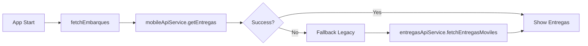
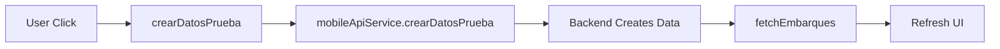
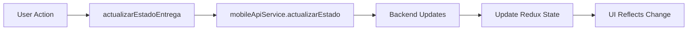

# Resumen de Cambios - Adaptación a Nuevos Endpoints del Backend

## 📝 Cambios del Backend Implementados

### Cambios en el Backend (Información recibida)
1. **✅ TestDataWriteRepository.cs:**
   - `EstatusEmbarqueId`: Cambiado de 2 (Creado) a 4 (En ruta)
   - `EsTestData`: Cambiado a `false` para que aparezcan en el flujo normal

2. **✅ Simplificación del Handler:**
   - Eliminada lógica compleja separada para datos de prueba
   - Procesamiento uniforme de todos los embarques
   - Mejor mapeo de datos hacia DTOs

3. **✅ Nuevos Endpoints:**
   - `PUT /api/mobile/entregas/{id}/estado` - Actualizar estado
   - `GET /api/mobile/entrega/{id}` - Obtener entrega específica

## 🔧 Cambios Realizados en el Frontend

### 1. **Actualización del Servicio de Entregas** (`entregasApiService.ts`)
```typescript
// ✅ Nuevo método principal
async fetchEntregasMoviles(): Promise<ClienteEntregaDTO[]> {
  // Usa GET /Mobile/entregas en lugar de /EmbarquesEntrega
}

// ✅ Nuevos métodos para endpoints móviles
async getEntregaById(id: string | number): Promise<EntregaDTO>
async actualizarEstadoEntrega(id: string | number, nuevoEstado: string): Promise<void>
async confirmarEntrega(confirmacion: {...}): Promise<void>
async getRutaChofer(): Promise<any>

// ✅ Método legacy marcado como deprecated
async fetchEmbarquesEntrega(): Promise<ClienteEntregaDTO[]> {
  // @deprecated - mantiene compatibilidad hacia atrás
}
```

### 2. **Nuevo Servicio Móvil** (`mobileApiService.ts`)
```typescript
// ✅ Servicio especializado para endpoints móviles
class MobileApiService {
  async getEntregas(): Promise<ClienteEntregaDTO[]>          // GET /Mobile/entregas
  async getEntregaById(id): Promise<EntregaDTO>              // GET /mobile/entrega/{id}
  async actualizarEstado(id, estado): Promise<void>          // PUT /mobile/entregas/{id}/estado
  async confirmarEntrega(datos): Promise<{...}>              // POST /Mobile/confirmar-entrega
  async getRuta(): Promise<any>                              // GET /Mobile/ruta
  async crearDatosPrueba(config): Promise<any>               // POST /TestData/crear-datos-completos
  async ping(): Promise<{...}>                               // GET /health
}
```

### 3. **Actualización del Store Redux** (`entregasSlice.ts`)
```typescript
// ✅ Acción principal actualizada
export const fetchEmbarques = createAsyncThunk(
  'entregas/fetchEmbarques',
  async (_, { rejectWithValue }) => {
    try {
      // 🚀 Usa nuevo endpoint móvil
      const clientes = await mobileApiService.getEntregas();
      return clientes;
    } catch (error) {
      // 🔄 Fallback al método legacy
      const clientes = await entregasApiService.fetchEntregasMoviles();
      return clientes;
    }
  }
);

// ✅ Nuevas acciones async
export const actualizarEstadoEntrega = createAsyncThunk(...)
export const confirmarEntrega = createAsyncThunk(...)
export const crearDatosPrueba = createAsyncThunk(...)
```

### 4. **Pantalla de Debug Actualizada** (`DebugApiScreen.tsx`)
```typescript
// ✅ Nuevos botones de prueba
- Test Mobile/entregas (NUEVO)      // Prueba GET /Mobile/entregas
- Crear Datos de Prueba             // POST /TestData/crear-datos-completos
- Test RAW API Call                 // Fallback testing

// ✅ Manejo de errores mejorado
- Muestra información sobre cambios del backend
- Fallback automático en caso de error
- Logging detallado para debugging
```

### 5. **Pantalla Principal Actualizada** (`ClientesEntregasScreen.tsx`)
```typescript
// ✅ Nuevas funcionalidades
const crearNuevosDatosPrueba = async () => {
  await dispatch(crearDatosPrueba({
    cantidadClientes: 3,
    cantidadEntregas: 5,
    generarRutaGPS: true
  }));
  await loadData(); // Recarga automática
};

// ✅ Nuevos botones en estado vacío
- Crear Nuevos Datos             // Crea datos de prueba frescos
- Cargar Datos Existentes        // Método legacy
- Probar API                     // Debug screen

// ✅ Mensaje actualizado
"Cambios del backend:
• EstatusEmbarqueId = 4 (En ruta)
• EsTestData = false para datos de prueba
• Procesamiento uniforme de embarques
• Usuario: alfredo.gallegos"
```

## 📋 Endpoints Disponibles

### Endpoints de Entregas
| Método | Endpoint | Descripción | Estado |
|--------|----------|-------------|---------|
| `GET` | `/Mobile/entregas` | Lista entregas por chofer | ✅ Implementado |
| `GET` | `/mobile/entrega/{id}` | Obtiene entrega específica | ✅ Implementado |
| `PUT` | `/mobile/entregas/{id}/estado` | Actualiza estado | ✅ Implementado |
| `POST` | `/Mobile/confirmar-entrega` | Confirma entrega con GPS | ✅ Implementado |
| `GET` | `/Mobile/ruta` | Obtiene ruta del chofer | ✅ Implementado |

### Endpoints de Testing
| Método | Endpoint | Descripción | Estado |
|--------|----------|-------------|---------|
| `POST` | `/TestData/crear-datos-completos` | Crea datos de prueba | ✅ Implementado |
| `GET` | `/health` | Verificar conectividad | ✅ Implementado |

### Endpoints Legacy (Compatibilidad)
| Método | Endpoint | Descripción | Estado |
|--------|----------|-------------|---------|
| `GET` | `/EmbarquesEntrega` | Lista embarques (legacy) | ⚠️ Deprecated |
| `POST` | `/EmbarquesEntrega` | Enviar embarque (legacy) | ⚠️ Deprecated |

## 🔄 Flujo de Trabajo Actualizado

### 1. **Carga de Entregas**


### 2. **Creación de Datos de Prueba**


### 3. **Actualización de Estado**


## 📱 Funcionalidades Nuevas

### En la Pantalla Principal
- **✅ Botón "Crear Nuevos Datos"**: Genera datos de prueba frescos desde el backend
- **✅ Botón "Cargar Datos Existentes"**: Método legacy para datos existentes
- **✅ Información actualizada**: Refleja los cambios del backend

### En la Pantalla de Debug
- **✅ Test Mobile/entregas**: Prueba el nuevo endpoint principal
- **✅ Test Crear Datos**: Genera datos de prueba directamente
- **✅ Fallback automático**: Si falla el nuevo endpoint, prueba el legacy
- **✅ Logging detallado**: Para troubleshooting

### En el Store Redux
- **✅ Nuevas acciones**: Para todos los endpoints móviles
- **✅ Estados actualizados**: Tracking de confirmaciones y actualizaciones
- **✅ Error handling mejorado**: Con fallbacks automáticos

## 🧪 Testing y Debugging

### Orden Recomendado de Testing
1. **Verificar conectividad**: Usar botón "Test Health"
2. **Crear datos frescos**: Usar "Crear Nuevos Datos" en pantalla principal
3. **Verificar carga**: Usar "Test Mobile/entregas" en debug
4. **Probar flujo completo**: Navegar por las entregas creadas

### Troubleshooting
- **Array vacío**: Usar "Crear Nuevos Datos" para generar contenido
- **Error de conexión**: Verificar URL del backend en environments
- **Datos incorrectos**: Usar pantalla de debug para verificar respuestas

## ⚡ Compatibilidad

### Backward Compatibility
- **✅ Métodos legacy**: Marcados como deprecated pero funcionales
- **✅ Fallbacks automáticos**: Si fallan nuevos endpoints
- **✅ Estructura de datos**: Mantiene compatibilidad con componentes existentes

### Forward Compatibility
- **✅ Nuevos endpoints**: Listos para funcionalidades futuras
- **✅ Estados extendidos**: Soporte para workflows complejos
- **✅ Arquitectura escalable**: Fácil agregar nuevos endpoints

## 🎯 Próximos Pasos

1. **✅ Reiniciar aplicación**: Para aplicar todos los cambios
2. **✅ Crear datos de prueba**: Usar el nuevo botón
3. **✅ Verificar flujo**: Probar carga y navegación
4. **⏳ Aplicar migración BD**: Cuando haya conectividad
5. **⏳ Descomentar campos móviles**: Tras migración exitosa

## 📊 Resumen de Archivos Modificados

| Archivo | Cambios | Estado |
|---------|---------|---------|
| `entregasApiService.ts` | Nuevos métodos + deprecation | ✅ |
| `mobileApiService.ts` | Servicio nuevo completo | ✅ |
| `entregasSlice.ts` | Nuevas acciones Redux | ✅ |
| `DebugApiScreen.tsx` | Botones + testing nuevos endpoints | ✅ |
| `ClientesEntregasScreen.tsx` | UI + funcionalidades nuevas | ✅ |
| `services/index.ts` | Export del nuevo servicio | ✅ |

¡Todos los cambios han sido implementados y están listos para testing! 🚀